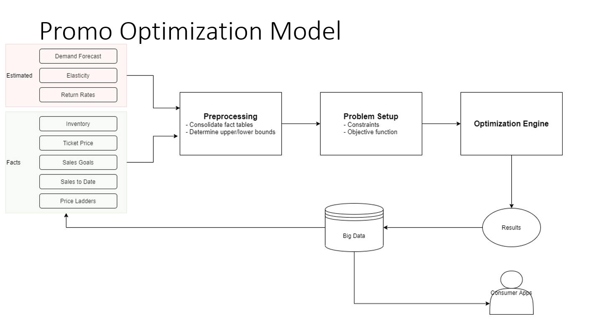

# Pricing Optimization Engine
**Elasticity-Driven Profit Maximization & Price Recommendation (Portfolio Demo)**

This repository provides an end-to-end **pricing optimization pipeline** that:
- estimates **price elasticity** from historical sales,
- models a **demand curve** per SKU,
- formulates a **profit-maximization** objective,
- applies **business constraints** (floors/ceilings/price ladders),
- and generates **price recommendations** with expected uplift.

> ✅ **GitHub-safe by design**: no database credentials, no connection strings, no customer data.  
> The project runs fully on **sample CSVs** under `data/sample/`.

---

## Architecture (Promo / Pricing Optimization Model)



Pipeline stages:
1. **Estimated signals** (forecast, elasticity, returns) + **facts** (inventory, ticket price, targets, ladders)
2. **Preprocessing**: consolidate tables, compute bounds
3. **Problem setup**: objective + constraints
4. **Optimization engine**: maximize profit under business rules
5. **Results**: recommended prices + expected demand/profit impact

---

## Why this matters (business framing)

Cost-plus pricing and static margin rules are easy to implement, but they ignore demand response.

When you don’t model elasticity:
- you can price too low → **profit leakage**
- or price too high → **volume collapse**
- promotions become reactive rather than strategic

This engine makes pricing decisions **measurable** and **auditable**:
- “If we change price by X, what happens to demand and profit?”
- “Which SKUs are inelastic enough to take a price increase?”
- “What margin floor keeps the business protected?”

---

## Core model (article-style summary)

### 1) Elasticity estimation
Per SKU, we fit a log-log model:

\[
\ln(Q) = \ln(a) + b\,\ln(P)
\]

- **b** is the price elasticity (typically negative)
- **a** is a scale parameter

In code: `src/pricing_engine/elasticity.py`


### 1) Seasonality layer 

In real-world pricing data, observed demand is often a mixture of **price effect** and **time/season effect**.
If you estimate elasticity directly on raw demand, you risk attributing seasonal spikes/dips to price.

This repo includes a pragmatic seasonality layer:

- **Month-of-year seasonality index** per SKU (fast, explainable)
- Optional **STL decomposition** hook (for richer decomposition when you have long series)

Workflow:

1. Fit a per-SKU seasonal index (normalized to mean = 1.0)
2. Create `qty_deseasonalized = qty_sold / seasonal_index`
3. Estimate elasticity on `qty_deseasonalized`
4. Scale predicted demand/profit back to the current month via the seasonal index (reported in outputs)

Outputs include:
- `seasonality_index` (for the current month)
- `seasonality_strength` (0–1 proxy)
- `current_profit_seasonal` / `optimal_profit_seasonal`

### 2) Demand function
From the model we construct:

\[
D(P) = a\,P^{b}
\]

In code: `src/pricing_engine/demand_model.py`

### 3) Profit objective
We optimize contribution profit:

\[
\Pi(P) = (P - C)\,D(P)
\]

In code: `src/pricing_engine/profit_function.py`

### 4) Constraints (business rules)
We solve a constrained optimization:

- **Price floor** (margin protection): `price >= cost * min_multiplier`
- **Price ceiling** (market / ladder cap): `price <= cost * max_multiplier`
- **Max change rule**: `|Δprice| <= max_change_pct`

Constraints are driven by `data/sample/sample_price_ladders.csv`  
In code: `src/pricing_engine/constraints.py`

### 5) Optimization engine
We maximize profit by minimizing negative profit using **L-BFGS-B**:
- fast, supports bounds, good for smooth objectives

In code: `src/pricing_engine/optimizer.py`

### 6) Output metrics
For each SKU:
- current vs optimal price
- expected demand at both prices
- profit at both prices
- uplift %

In code: `src/pricing_engine/simulator.py`

---

## Quickstart (runs in 3–5 minutes)

### 1) Install
```bash
pip install -r requirements.txt
```

### 2) Run the demo web app (Flask)
```bash
python app/pricing_app.py
```

Open:
- http://localhost:8055

---

## Data

This repo includes **sample data only**:
- `data/sample/sample_sales.csv`
- `data/sample/sample_cost.csv`
- `data/sample/sample_price_ladders.csv`

**Important:**
- Put any real extracts under `data/raw/` or `data/private/` (both are git-ignored).
- Never commit exports that can identify customers or internal endpoints.

---

## Security & privacy

- `.env` is ignored by git
- `.env.example` shows placeholders only
- `SECURITY.md` lists what must not be committed

---

## Repo structure

```
pricing-optimization-engine/
  assets/         # diagrams used in README
  data/sample/    # synthetic CSVs (safe to commit)
  src/            # core pricing engine
  app/            # Flask demo UI
  sql/            # templates only (no real connection strings)
  tests/          # minimal test
  docs/           # extra write-ups
```

---

## What this repo is / is not

✅ **Is**
- Portfolio-grade demonstration of pricing optimization
- Elasticity-driven decisioning + constrained optimization
- Runnable end-to-end demo

❌ **Is not**
- A production deployment
- A complete forecasting system
- A connected warehouse/ERP integration (intentionally excluded)

---
